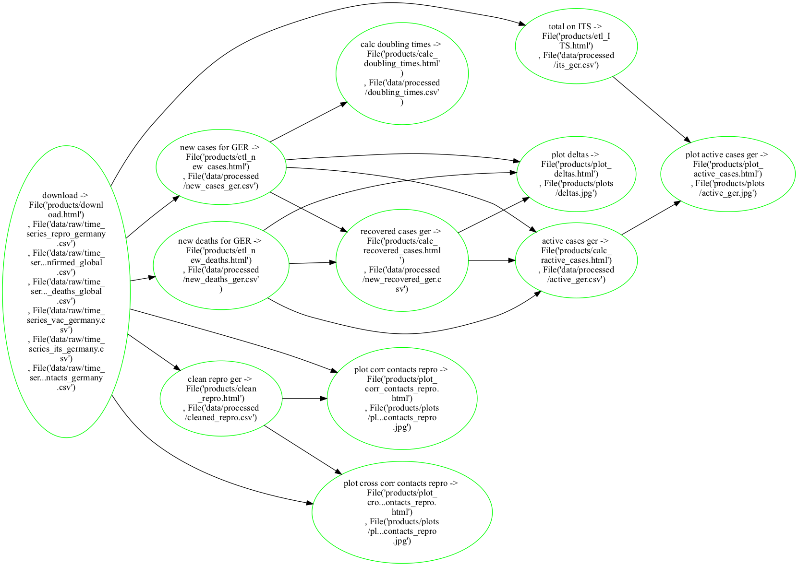

# COVID19

Some data pipelines and scripts for creating data about the spread of COVID-19 in Germany based on data from official sources. 

Discussion for plots: https://hundt.me/2021/12/07/covid-contact-reduction.html

## Usage
This repository uses [ploomber](https://github.com/ploomber/ploomber) for orchestration.

```bash
pip install -r requirements.txt
ploomber build --force
```

The resulting plots can be found under ```products/plots/``` and the data is stored in ```data/raw/``` as well as ```data/processed/```.

## Pipeline


## Data:
- RKI Nowcasting: https://www.rki.de/DE/Content/InfAZ/N/Neuartiges_Coronavirus/Projekte_RKI/Nowcasting.html
- Covid-19 Mobility Project: https://www.covid-19-mobility.org/contact-index/
- DIVI Intensivregister: https://www.intensivregister.de/
- Impfdashboard: https://impfdashboard.de/daten
